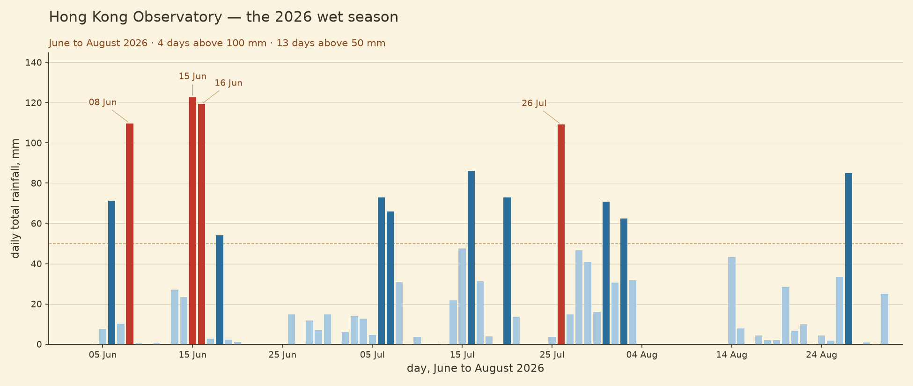

# Hong Kong rainfall, 2026



## The phenomenon

Rain. The Hong Kong Observatory has measured how much falls each day since 1884.
This repo looks at the 2026 record: one number per day, in millimetres, for the
first eight months. I looked at it because rain is the one Hong Kong phenomenon
that everybody experiences but nobody keeps a personal record of, and the
Observatory does keep a record — 49,492 rows of it.

## The source

- **From:** <https://data.weather.gov.hk/weatherAPI/cis/csvfile/HKO/ALL/daily_HKO_RF_ALL.csv>
- **File in this repo:** [`data/rainfall-daily.csv`](data/rainfall-daily.csv)
- **What a row is:** one calendar day. Five columns: year, month, day, total
  rainfall in millimetres, and a data-quality flag (`C` means complete).
  The file has 49,492 rows, covering 1884-03-01 to 2026-08-31.

## What the picture shows

It shows daily total rainfall at the Hong Kong Observatory for the first eight
months of 2026. January and February are almost dry; the rain arrives in March
and peaks in June, with one day above 120 mm. It **hides** two things: the
annual total, which you would have to add up yourself, and how the same months
looked in previous years, which would need a second chart built on the other
49,000 rows of the file.

## Run it

```
uv run fetch.py
uv run plot.py
```
