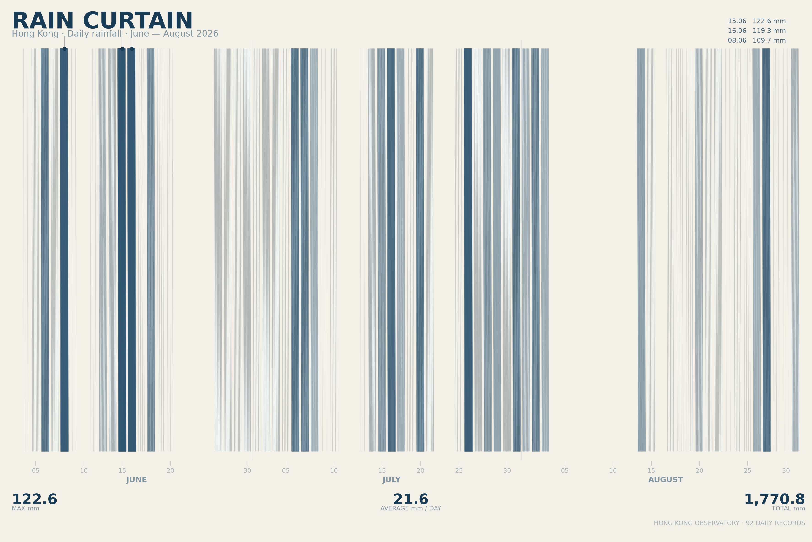

# Hong Kong Rainfall, 2026



## The phenomenon

Rain is one of the most familiar natural phenomena in Hong Kong. The Hong Kong Observatory has recorded daily rainfall for more than a century.

This project looks at daily rainfall during June, July, and August 2026. Instead of presenting the data as a conventional bar or line chart, I treated the rainfall values as visual material and translated them into a continuous field of rain.

## The source

* **From:** https://data.weather.gov.hk/weatherAPI/cis/csvfile/HKO/ALL/daily_HKO_RF_ALL.csv
* **File in this repo:** `data/rainfall-daily.csv`
* **What a row is:** one calendar day. The five columns contain year, month, day, total rainfall in millimetres, and a data-quality flag (`C` means complete).
* **Coverage:** 1884-03-01 to 2026-08-31
* **Total rows:** 49,492

## What the picture shows

The image represents 92 days of daily rainfall from June to August 2026.

Each day becomes a small area within the continuous rain field. The rainfall amount controls the visual density, thickness, and opacity of the rain strokes. Days with more rainfall therefore create a heavier and darker part of the curtain, while days with little or no rainfall leave lighter or empty areas.

The image also includes the three highest rainfall events and a small set of summary statistics, but these supporting elements are kept secondary to the main rain field.

The picture **hides** the rainfall from the rest of the year and does not compare 2026 with previous years. It also does not show the exact numerical value of every individual day as clearly as a conventional chart would. Instead, it focuses on turning the numerical pattern of rainfall into a visual and atmospheric form.

## Run it

```bash
uv run fetch.py
uv run plot.py
```
